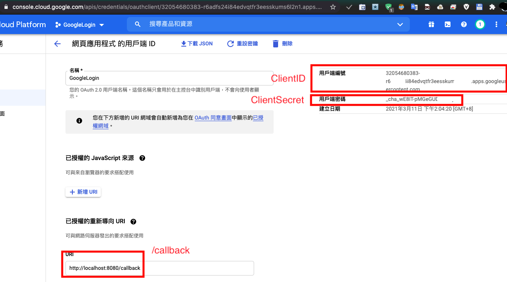

## 前言
 WebServer＋GoogleOauth2

## 環境變數說明
```bash
#cpu執行核心數設置
cpu_core=0

#設置頁面https://console.cloud.google.com/apis/credentials
host_scheme=http://
host_domain_name=localhost
host_port=8080
google_oauth2_clientID=3205468xxxxxx-xxxx.apps.googleusercontent.com
google_oauth2_secret_code=_chaXXXXX
google_oauth2_callback_path=callback

#新增白名單Gmail帳號
add_google_email=XXXXXXXX1@gmail.com
add_google_email=XXXXXXXX2@gmail.com
```

## Google憑證申請說明

請至 https://console.cloud.google.com/apis/credentials

## 接口服務使用時序圖說明

## 檔案樹說明
```bash
├── build/ #專案執行檔放置處(包括環境設定檔、網頁版模)
├── configs/ #專案執行相關設定檔
│   ├── script.sh #自訂執行伺服器.sh腳本
│   └── webstie.conf #環境變數設定檔
├── deploy/ #容器化專案所需檔案放置處,如:docker-compose.yml
├── docs/ #專案文檔放置處
├── internal/ #golang main() 私有pkg 
│   ├── antifood/ #golang 防food模組pkg
│   └── system/ #golang OS系統設置模組pkg
├── pkg/ #golang main() 公有pkg 
│   ├── common/ #golang 常用函式pkg
│   │   ├── common.go #golang 常用函式pkg入口
│   │   └── fileInfo #golang 檔案資訊模組pkg
│   ├── global/ #golang 公用全域變數pkg
│   │   ├── config/ #golang 環境變數設定模組
│   │   ├── customVar/ #golang 字串轉換任意變數模組pkg
│   │   ├── googleOauth2/ #golang google帳號認證模組pkg
│   │   └── global.go #golang 公用全域變數pkg入口
│   └── web/ #golang web服務核心pkg
│       ├── encrypt/ #golang 加密核心模組pkg
│       ├── web_fileupload.go #golang web服務檔案上傳(接口)
│       ├── web_handle.go #golang web服務handle(接口)
│       └── web_template.go #golang web服務模版輸出
│ 
├── go.mod #golang版控相關
├── go.sum #golang版控相關
├── main.go #golang main()整體專案入口
├── runBuild.sh #build執行檔腳本（編譯完成自動放置至./build）
├── runUnitTest.sh #執行所以pkg單元測試
│ 
└── website/ #網頁版模與靜態資源
    ├── downloads/ #下載清單檔案放置處
    ├── images/ #網頁公用靜態資源 - 圖片
    ├── others/ #網頁公用靜態資源 - 其他檔案分類
    ├── pages/ #網頁公用靜態資源 - 純html頁面
    │   └── index-Menu.html #首頁頁面
    ├── templates/ #網頁公用靜態資源 -版模
    └── uploads/ #上傳檔案放置處

```

## URN Path說明
```bash
	/         #GET 根目錄將自動轉跳/login?state=indexMenu
	/login	  #GET&POST 登陸接口,所有網頁服務必需通過此接口
	/callback #GET 驗證客戶端獲得的GoogleOauth2認證碼,並藉由Query 'state'標籤後開始後續使用服務
        /upload   #POST 上傳檔案接口,上傳過程包含Token驗證,同時間只能容許一位使用者操作
```

